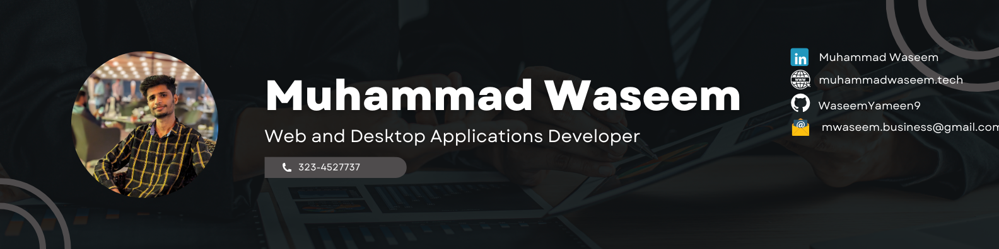

  <a href="https://www.github.com/WaseemYameen9"><a/>
  
  

<h1 align="center">hey there 👋</h1>
<h3 align="left" >My Name is Waseem</h3>

<h3 align="left">👩‍💻  About Me</h3>

 I am a passionate programmer with a strong foundation in C#, Javascript and Python. I have experience in both web development and desktop application development, and I am always looking for new challenges to improve my skills.I am a quick learner, and I am always seeking new opportunities to grow and learn. If you have a project that could benefit from my programming skills and problem-solving abilities, don't hesitate to reach out. I am excited to see where my career in computer science takes me in the future.

 
 

- 📚 I'm a 3rd year student at UET Lahore. - 🔭 I’m working as an intern at Bookme.pk  - 📚 I'm currently learning ML/AI

<h3 align="left">🛠 Language and tools</h3>

  
  
  
  
  
  
  
  
  
  
  
  
  
  
  
  
  

